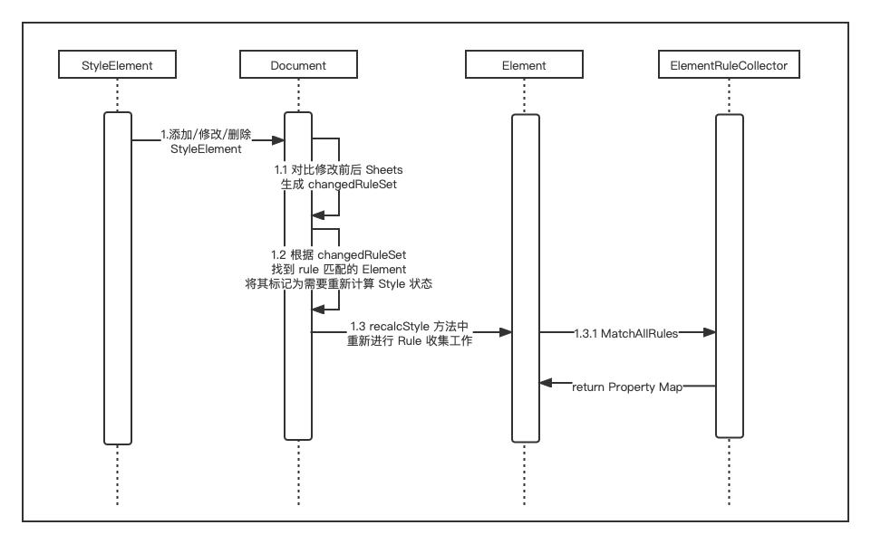

## Introduction

Support most CSS Selector & API

## Motivation

At present, Kraken only supports the ClassSelector in the basic selector, and does not support other basic selectors, as well as more complex combinators and pseudo, which leads to the frequent need to recombine CSS when using Kraken to adapt existing pages.

## Proposed solution

1. Support parsing & matching common Selectors（https://developer.mozilla.org/en-US/docs/Web/CSS/CSS_Selectors）
    - tag
    - #id
    - .class
    - :pseudo
        - :nth-child(an+b|odd|even)
        - :first-child
        - :last-child
        - :only-child
    - Group
        - ,
    - Combinator
        - " "
        - \>
        - \+
        - _
    - Attribute
        - [attribute]
        - [attribute=value]
        - [attribute|=value]
        - [attribute^=value]
        - [attribute$=value]
        - [attribute~=value]
        - [attribute*=value]

2. Support Inline Style update, optimize StyleSheet Element and class Attribute update policy
   
     1. Inline Style currently only supports Style Property and Element attribute class to update styles, and needs to be supplemented with a complete inline style style update

## Detailed design

1. CSS Selector parse & index
    
    
    
     detail:
    
    1. transplant [CSSlib](https://github.com/dart-lang/csslib) token parsing logic
    2. RuleMap 
        1. key : CSSSelectorList.last.selectorText
        2. value: CSSRule
        3. 
2. CSS matching rules
    
    
    
    1. Document needs to be added to the RuleSet that holds the result of the first step of parsing
    2. Find all rules matching Element: ElementRuleCollector
        1. Take out the corresponding Rule in the order of id, class, pseudo, and tag
        2. Check for rule matching elements: SelectorChecker
    3. Calculate the priority of the matched Rule according to the Selector, sort it according to the priority from low to high and return

### 2. Update Style

1. Update StyleSheet Element
    
    At present, when the StyleSheet is updated, it will cause the entire page to recalculate the Style style, which is optimized to update on demand    

1. inline style
    1. Element and CSSStyleDeclaration support cssText settings, and can directly override the style in element after parsing, and reuse the existing logic of RenderStyle to directly mark UI refresh
    2. Presentation Property support
2. Selector
    1. Update the ID and class name, update to ElementRuleCollector, re-match the rules, calculate the priority to get the final Style, reuse the existing Style Diff logic, and update
3. Existing Pseudo Selectors that need support, do not need to handle state updates

### 3. Support getComputedStyle

Return the ElementRuleCollector to the property map and return it directly

### 4. Support dev tool

1. getMatchedStylesForNode
2. getComputedStyleForNode

### 5. Optimize querySelector performance

Each Element caches its current Selector. When Querying Selector, the Selector Group can be parsed directly through the Dart side, and the Document can be used to recursively match the Selector to the entire tree.

### TODO

1. [Animation]([https://developer.mozilla.org/en-US/docs/Web/CSS/CSS_Animations/Using_CSS_animations](https://developer.mozilla.org/en-US/docs/Web/CSS/CSS_Animations/Using_CSS_animations))
2. MediaQuery
3. import
4. Validate CSS in development mode
