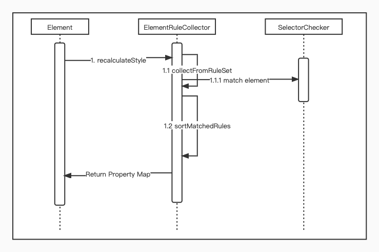

# 支持 CSS 常用 Selector & API

## 简介

支持 CSS 常用 Selector & API

## 背景

目前 Kraken 仅支持了基本选择器中的 ClassSelector 语法，还未支持其他简单选择器以及更复杂的 combinators、pseudo，导致在使用 Kraken 适配已有页面时经常需要重新梳理 CSS.

## 解决方案

1. 支持解析 & 匹配常用 Selector（https://developer.mozilla.org/en-US/docs/Web/CSS/CSS_Selectors）
    - tag
    - #id
    - .class
    - :pseudo
        - :nth-child(an+b|odd|even)
        - :first-child
        - :last-child
        - :only-child
    - Group
        - ,
    - Combinator
        - " "
        - \>
        - \+
        - _
    - Attribute
        - [attribute]
        - [attribute=value]
        - [attribute|=value]
        - [attribute^=value]
        - [attribute$=value]
        - [attribute~=value]
        - [attribute*=value]
2. 支持 Inline Style 更新，优化 StyleSheet Element 和 class Attribute 更新机制
    1. inline Style 目前仅支持 Style Property 和 Element attribute class 两种方式更新样式，需要补充完整的 inline style 样式更新

## 详细设计

### 1. CSS Selector 解析 & 索引

 细节：

1. 移植 [CSSlib](https://github.com/dart-lang/csslib) token 解析逻辑， 并需要支持 inline style 的解析
2. RuleSet 中的 RuleMap 
    1. key : CSSSelectorList.last.selectorText
    2. value: CSSRule
3. Element 匹配 CSS 规则
    
    
    
    1. Document 需要增加持有第一步解析的结果 RuleSet
    2. 查找 Element 匹配的所有 rule: ElementRuleCollector
        1. 按照 id、class、pseudo、tag 顺序取出所有对应的 Rule
        2. 检查规则是否匹配元素: SelectorChecker
    3. 将匹配后的 Rule 和 inline style 收集起来
        1. 按照 Selector 计算出优先级，按照优先级从低到高排序，返回已经去重的 Property Map

### 2. 样式更新

1. StyleSheet Element 更新
    
    目前 StyleSheet 更新时会导致整个页面重新计算 Style 样式，优化为按需更新
    

1. inline style
    1. Element 和 CSSStyleDeclaration 支持 cssText 设置，并解析后直接覆盖 element 中 style 即可，复用 RenderStyle 现有逻辑直接标记 UI 刷新
    2. Presentation Property 支持
2. Selector
    1. 更新 ID 和 class name，更新至 ElementRuleCollector，重新匹配规则，计算优先级得出最后的 Style，复用现有 Style Diff 逻辑，进行更新
3. 现有需要支持的 Pseudo Selector，不需要处理状态更新

### 3. 支持 getComputedStyle

将 ElementRuleCollector 返回到 property map 直接返回即可

### 4. dev tool更新

1. getMatchedStylesForNode
2. getComputedStyleForNode

### 5. 优化 querySelector 性能

每个 Element 缓存自己当前的 Selector，在 Query Selector 时可以直接通过 Dart 侧解析出 Selector Group，直接 Document 对整个树进行递归匹配 Selector 即可

### TODO

1. [Animation]([https://developer.mozilla.org/en-US/docs/Web/CSS/CSS_Animations/Using_CSS_animations](https://developer.mozilla.org/en-US/docs/Web/CSS/CSS_Animations/Using_CSS_animations))
2. MediaQuery
3. import
4. 开发模式下对 CSS 进行校验