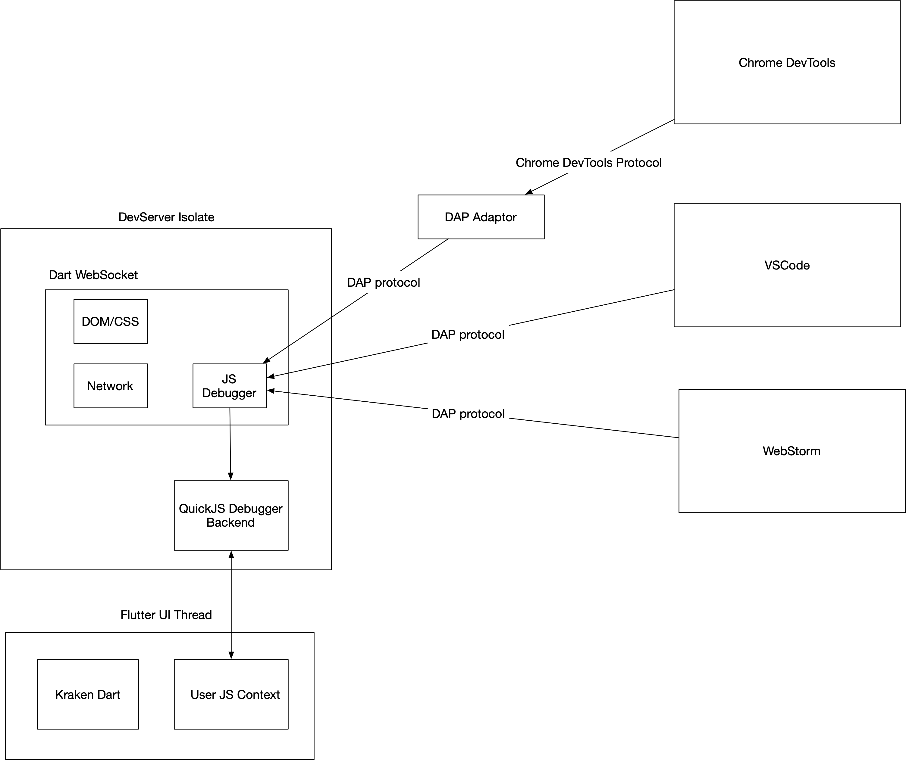

# Kraken QuickJS Debugger Design

Before the 0.9.0 version, Kraken used JavaScriptCore as the JS engine and provided a JavaScript Debugger implementation based on JavaScriptCore.

However, after version 0.9.0, Kraken migrated to the QuickJS engine. Therefore, it is necessary to re-implement the Debugger function

##  Design goals

A design needs to both meet current functional requirements and prepare for hidden changes in potential future iterations. A good design requires the thinking of predecessors to plant trees and future generations to enjoy the shade, so it is necessary to confirm the ultimate goal of this function before completing the design.

## The ultimate goal of JS Debugger

We hope that Kraken's JavaScript Debugger can perform code debugging smoothly without any JS Engine or any debugging tools, including but not limited to Chrome DevTools, VsCode Debugger, and WebStore Debugger.

## Community existing resources

1. QuickJS debugging implementation based on vscode DAP protocol
   1. https://www.freelists.org/post/quickjs-devel/QuickJS-Debugger-implementation-for-VSCode
   2. https://github.com/koush/quickjs
   3. https://github.com/koush/vscode-quickjs-debug

2. Microsoft DAP protocol design
   1. https://code.visualstudio.com/blogs/2018/08/07/debug-adapter-protocol-website

3. DAP implementation adapted to Chrome DevTools
   1. https://github.com/microsoft/vscode-js-debug

​

## design

The debugger is divided into front-end and back-end. The front-end refers to the implementation layer of the DAP protocol and some adaptors compatible with other protocols.

The backend refers to the functions related to the language engine, such as the debugging function of QuickJS.
 
Among them, the Backend layer of QuickJS is developed based on the DAP protocol, and the secondary development is based on the branch of koush.

After having these resources, the debugger capabilities based on QuickJS, only need to integrate the above functions, you can achieve complete debugging functions, and can cross editors, support more JS Engine in the future, only need to be based on DAP It is enough to develop a backend for the protocol.