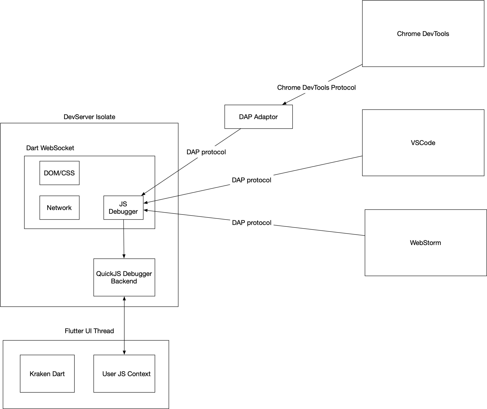

# Kraken QuickJS Debugger 设计

Kraken 在 0.9.0 版本之前，采用了 JavaScriptCore 作为 JS 引擎，并提供了基于 JavaScriptCore 的 JavaScript Debugger 实现。

不过 0.9.0 版本之后，Kraken 迁移到了 QuickJS 引擎。因此需要重新实现 Debgger 功能

##  设计目标

一个设计既要满足当前的功能需求，也需要为将来潜在的迭代过程中的隐藏更改做准备。一个好的设计需要前人栽树，后人乘凉的思考，因此在完成设计之前，确认这个功能最终的目标是必要的。

## JS Debugger 的最终目标

我们希望 Kraken 的 JavaScript Debugger 能够不限任何 JS Engine，不限制使用的调试工具，包括但不限于 Chrome DevTools，VsCode Debugger，WebStore Debugger，都可以流畅进行代码调试。

## 社区已有的资源

1. 基于 vscode DAP 协议的 QuickJS 调试实现
   1. https://www.freelists.org/post/quickjs-devel/QuickJS-Debugger-implementation-for-VSCode
   2. https://github.com/koush/quickjs
   3. https://github.com/koush/vscode-quickjs-debug

2. Microsoft DAP 协议设计
   1. https://code.visualstudio.com/blogs/2018/08/07/debug-adapter-protocol-website

3. 适配 Chrome DevTools 的 DAP 实现
   1. https://github.com/microsoft/vscode-js-debug

​	

## 设计

调试器分前端和后端，前端是指 DAP 协议的实现层，以及一些兼容到其他协议的 adaptor。

后端指和语言引擎有关的功能，比如 QuickJS 的调试功能。
 
其中QuickJS 的 Backend 层基于 DAP 协议进行开发，基于 koush 的分支进行二次开发。

在有了这些资源之后，基于 QuickJS 的调试器能力，只需要将以上这些功能整合起来，就可以实现完整的调试功能，并且能跨编辑器，后续支持更多的 JS Engine，只需要再基于 DAP 协议开发一个后端就可以了。

