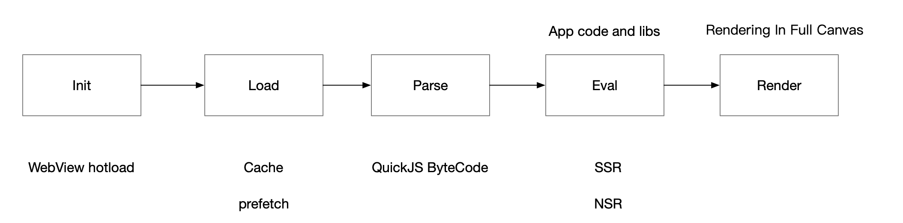
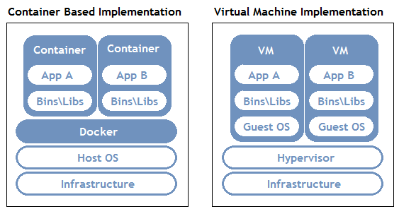

# Container render engine

## Summary

For a long time, apps developed using native client-side technologies have always had a better user experience than apps developed based on web technologies. However, web technology has its unique characteristics, such as support for dynamism, more powerful and flexible layout capabilities, and a huge web technology ecosystem.

Therefore, making technologies based on web standards to be infinitely close to the native experience has always been a topic that many engineers have been trying to explore.

The concept of containerization introduced this time is a way to be closer to the native application in the scenario where the application is first started.

## history

When trying to improve the first-time startup performance of web technology applications, there are many ways to improve the industry, which can be summarized in one picture.

A page, from initialization to user visibility, needs to complete the above five stages. The current optimization scheme is optimized around one or two stages.

Before introducing the new optimization solution, let's take a look at how the native client application initializes the page.

A purely natively developed application has the advantage of crushing web applications at every stage.

Therefore, all the performance optimization solutions for the Web are far from enough to make the Web experience follow the original client technology.

## Containerization scheme design

Containerization is to virtualize a container with isolation capability on a fully initialized rendering engine. Its idea comes from the design idea of ​​Docker, that is, in an application, the API provided by the operating system is virtualized, so that a running environment can be realized in a more lightweight way.

So we implement a rendering engine version of the container based on this idea:

To implement this container, two prerequisites are required:

1. Isolation of JS context between each Container
2. Isolation of HTML/CSS rendering context between each Container

If there is no such isolation, different Containers will affect each other, which will inevitably cause various problems, which will greatly affect normal use.

### JS context isolation

TS39 has provided a corresponding solution - [ShadowRealm](https://tc39.es/proposal-shadowrealm/)

It only allows functions to communicate across Realms and is an ideal solution for JS context isolation

### HTML/CSS rendering context isolation

The W3C Group also provides a corresponding solution - [ShadowDOM](https://developer.mozilla.org/en-US/docs/Web/Web_Components/Using_shadow_DOM)

It supports the creation of an independent rendering context on a single node, which can effectively isolate the effects of DOM manipulation and CSS cascading styles.

### How to handle the DOM API

By default, ShadowRealm does not provide a DOM API, only the standard JavaScript API. If an application is running in a container, it cannot manipulate the DOM isolated by ShadowDOM.

Therefore, here, we need to make a further evolution on the basis of the standard, package ShadowRealm and ShadowDOM, so that the JS Code in the ShadowRealm environment can access the DOM API inside the bound ShadowDOM.

## Containerized pipelines

## in conclusion

When Kraken adopts the containerization solution, the gap between the client and the native technology is only the Load and Eval phases. At the same time, like the native client, it can only load the application code that needs to be used instead of spending time. To initialize the heavy base library.