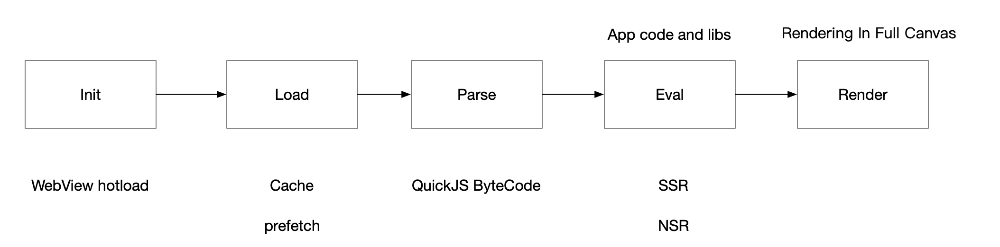
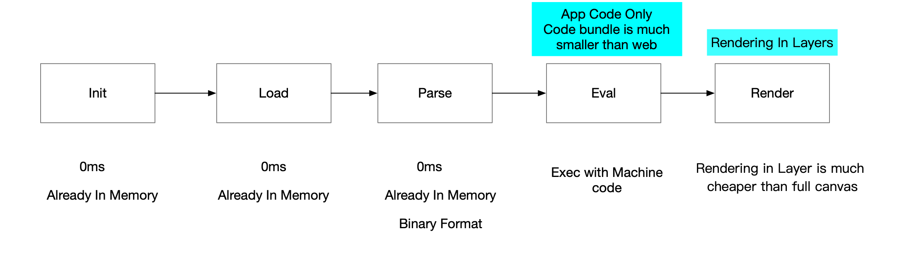
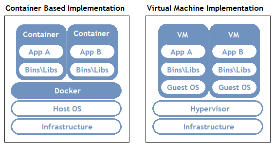
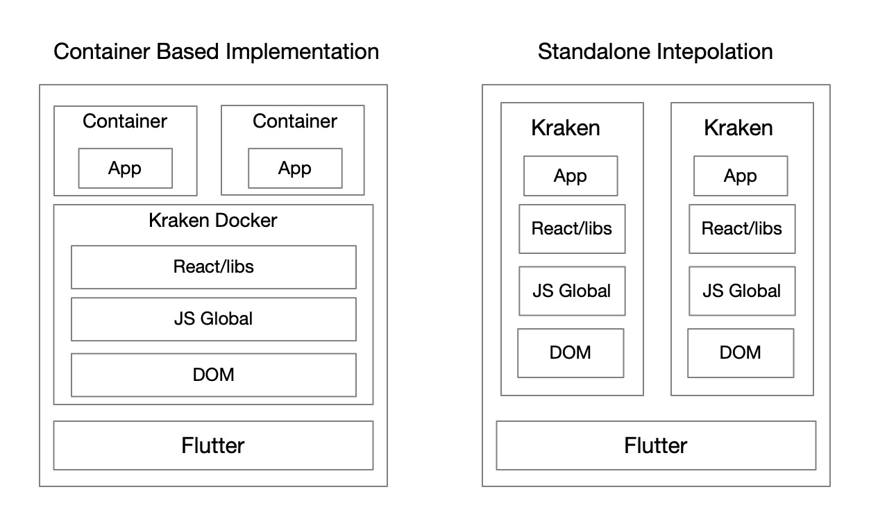
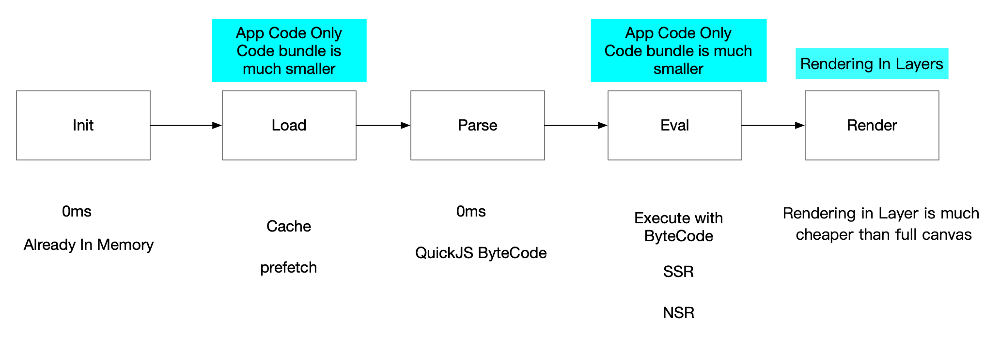

# 渲染引擎容器化

## 概要

长久以来，使用原生客户端技术开发的应用在使用体验上始终比基于 Web 技术开发的应用要好。但是 Web 技术又有着它独特的特性，比如支持动态化，更强大灵活的布局能力，以及庞大的 Web 技术生态等等。

因此让基于 Web 标准的技术能够在体验上无限接近原生一直是很多工程师所努力探索的课题。

这次介绍的容器化的概念，就是一种在应用首次启动的场景上，更加接近原生应用的一种方式。

## 历史

在尝试提升 Web 技术应用的首次启动性能，业界有很多提升的手段，这些手段都可以用一张图来概括。

一个页面，从初始化到用户可见，就需要完成以上的五个阶段。目前的优化方案，都是围绕其中一个或者两个阶段来进行优化。

在介绍新的优化方案之前，可以先来看看原生客户端应用是如何初始化页面的。

一个纯原生开发的应用，在每一个阶段，都有着对 Web 应用形成碾压的优势。

所以现在针对 Web 的所有性能优化方案，都远不足以让 Web 的体验追平原生客户端技术。

## 容器化方案设计

容器化，就是在一个已经完整初始化的渲染引擎上，虚拟出一个具备隔离能力的容器。它的思路源自 Docker 的设计思路，即在一个应用内，虚拟出操作系统所提供的 API ，从而可以用更加轻量的方式，实现一个运行环境。

所以我们基于这样的思路，实现一个渲染引擎版本的容器：

要想实现这个容器，就需要两个必备的条件：

1. 每一个 Container 之间 JS 上下文的隔离
2. 每一个 Container 之间，HTML/CSS 渲染上下文的隔离

如果没有这些隔离，不同的 Container 之间就会相互影响，这样难免就会出各种问题，非常影响正常使用。

### JS 上下文的隔离

TS39 已经提供了对应的解决方案—— [ShadowRealm](https://tc39.es/proposal-shadowrealm/)

它只允许函数进行跨 Realm 之间的通信，是 JS 上下文隔离的理想解决方案

### HTML/CSS 渲染上下文的隔离

W3C Group 也提供了对应的解决方案 —— [ShadowDOM](https://developer.mozilla.org/en-US/docs/Web/Web_Components/Using_shadow_DOM)

它支持在单一节点上，创建出一个独立的渲染上下文，可以有效隔离 DOM 操作和 CSS 层叠样式的影响。

### 如何处理 DOM API 

在默认情况下，ShadowRealm 不提供 DOM API，只提供了标准 JavaScript API。如果一个应用运行在容器中，就无法操作被 ShadowDOM 所隔离的 DOM。

因此在这里，需要在标准的基础上，再做一步的演进，把 ShadowRealm 和 ShadowDOM 打包起来，让 ShadowRealm 环境内的 JS Code 可以访问当被绑定的 ShadowDOM 内部的 DOM API。

## 采用容器化方案的流水线

## 结论

当 Kraken 采用了容器化方案之后，和客户端原生技术之间的差距，就只剩下 Load 和 Eval 阶段，同时也可以和原生客户端一样，仅仅加载需要使用的应用代码，而不是去花费时间去初始化繁重的基础库。
